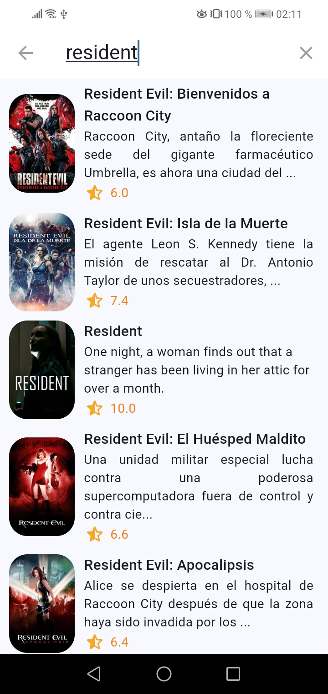

# Cinemapedia App

Cinemapedia is an application that allows users to browse a list of movies and get details about the cast associated with each one.


# Dev

You must install a version of java
```
java -version
```
Clone this repository
```
https://github.com/CarlossRreyes/cinemapedia-app.git
```
Update Flutter SDK to latest version (Optional)
```
flutter upgrade
```

1. Copy .env.template and rename a -env
2. Change environment variables (The MovieDB)

3. Reinstall packages:
```
flutter pub get
```
4. Verify the device or device emulator in the development environment:
```
flutter device
```
5. Execute in the device:
```
flutter run
```


**Cinemapedia images:**




